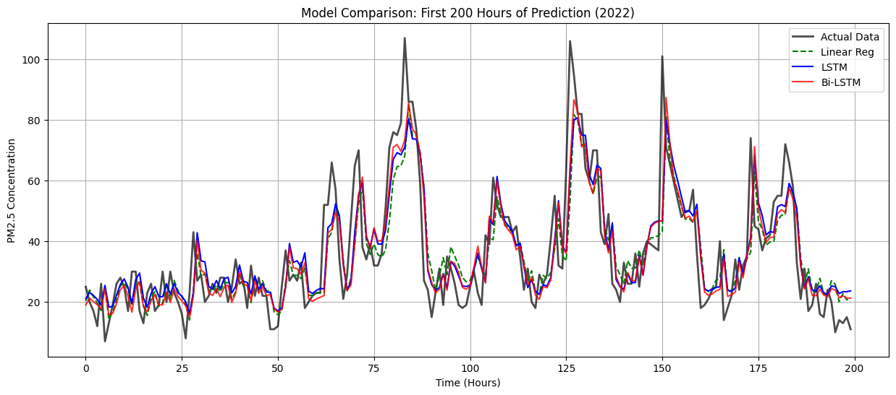

# HCMC Air Quality Forecasting

> A Deep Learning project analyzing and forecasting PM2.5 pollution levels in Ho Chi Minh City using neural network.


## Project Overview
This project investigates the application of Deep Learning to forecast air quality in Ho Chi Minh City. By analyzing 5 years of hourly PM2.5 data (2018–2022).


## Data & Processing
* **Source:** US Diplomatic Post (Ho Chi Minh City) & OpenAQ (CMT8 Station Validation).
* **Timeframe:** 2018–2022 (Hourly Resolution).
* **Preprocessing Pipeline:**
    * **Timezone Correction:** Converted UTC to Local Time (UTC+7) to align with traffic patterns.
    * **Physics Check:** Removed outliers (<0 or >500 µg/m³).
    * **Resampling:** Strict hourly grid enforcement with linear interpolation for small gaps (<4h).
    * **Feature Engineering:** Generated Lag features (1h, 24h, 168h/1 week) and Cyclical Time features (Sin/Cos of Hour, Day, Month).

## Model Architecture

* **Input:** (Batch, 1, 14 Features)
* **Layer 1:** `64 Units` + `Dropout(0.2)`
    * *Role:* Extracts high-level temporal features from both directions (Past ↔ Future).
* **Layer 2:** `32 Units` + `Dropout(0.2)`
    * *Role:* Compresses features and identifies complex non-linear relationships.
* **Output:** `Dense(1 Unit)`
    * *Role:* Regression output for PM2.5 concentration.

## Results (Test Set 2022)

| Model Architecture | MAE (µg/m³) | RMSE (µg/m³) | R² Score |
| :--- | :--- | :--- | :--- |
| **Linear Regression** | 5.71 | 8.54 | 0.628 |
| **LSTM** | 5.62 | 8.33 | 0.646 |
| **Bi-LSTM** | **5.51*** | **8.32*** | **0.646*** |

*Note: Metrics reflect the best-performing configuration.*

**Visual Validation:**



## Installation & Usage

### 1. Clone the Repo
```bash
git clone [https://github.com/yourusername/hcmc-air-quality-lstm.git](https://github.com/yourusername/hcmc-air-quality-lstm.git)
cd hcmc-air-quality-lstm
